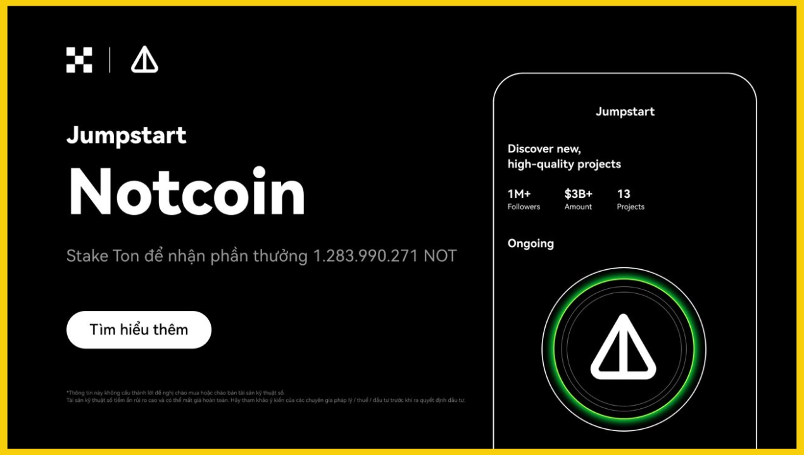
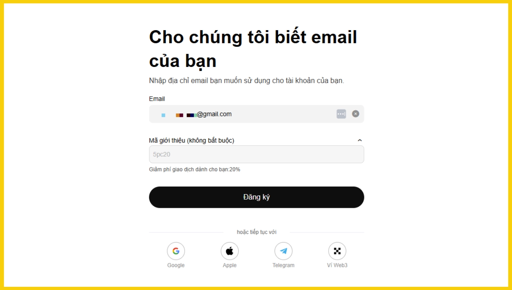
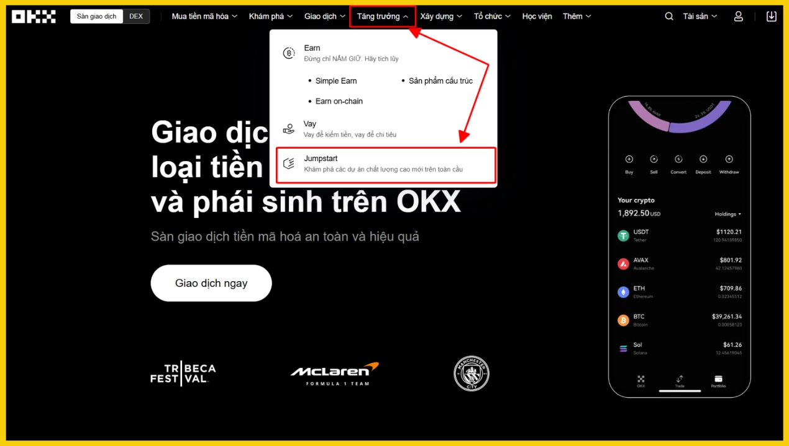
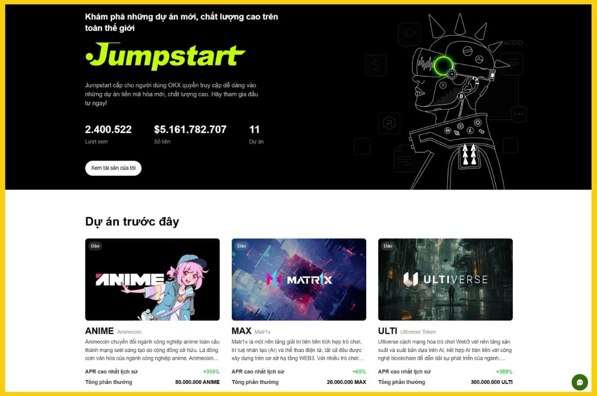
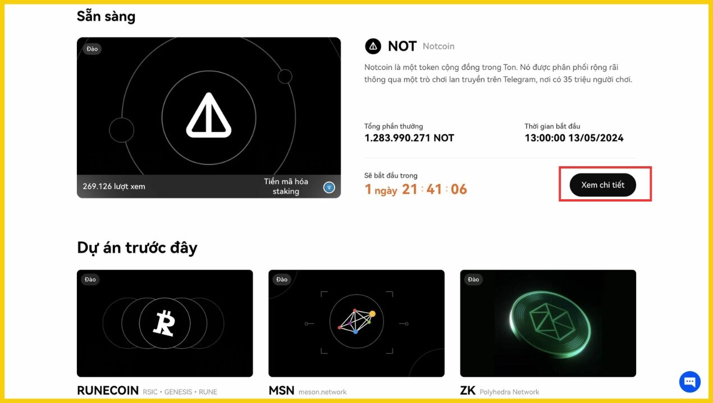
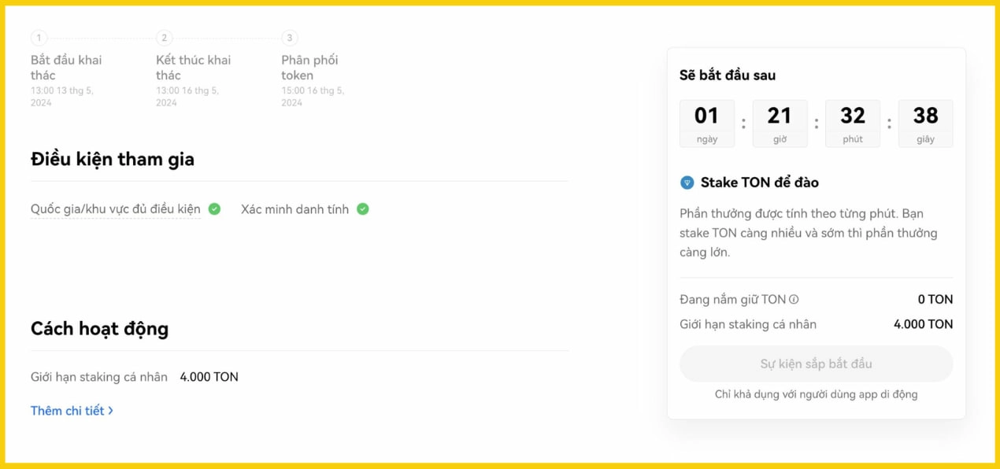
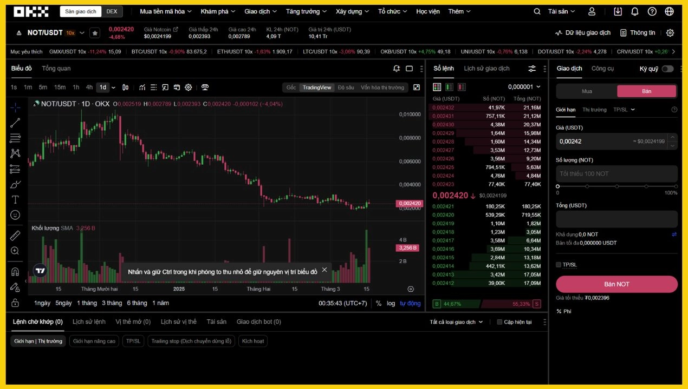

# What is OKX Jumpstart? Early Access Guide to New Crypto Projects

Discover how to get early access to promising cryptocurrency projects before they officially launch. Learn the complete process of participating in OKX Jumpstart, from staking requirements to reward distribution, and maximize your chances of earning returns from new token launches.

---

You know what's interesting? Most people miss out on the best crypto opportunities because they hear about projects too late. By the time a token hits the market, early investors have already secured their positions at better rates. That's exactly the problem OKX Jumpstart solves.

**OKX Jumpstart is a platform that gives users early access to new crypto projects before they officially list.** Users participate by staking BTC, ETH, or OKB to receive new project tokens. Think of it as getting a backstage pass to crypto launches—similar to Binance's popular Launchpool, but with OKX's distinctive approach.

OKX ranks among the top 3 global cryptocurrency exchanges according to Coingecko. The platform serves over 50 million users across more than 180 countries, offering comprehensive financial services including spot trading, derivatives, DeFi, and NFT marketplaces.

Some notable achievements of OKX Jumpstart include:

- Successfully launched 11 projects including Notcoin, Sui Network, Toncoin, and Raydium
- Total staked assets exceeding $5.1 billion
- Over 2.4 million user views

To participate in OKX Jumpstart, you need a verified OKX account. 👉 [Join OKX now and unlock exclusive early access to upcoming crypto projects with reduced trading fees](https://www.okx.com/join/47044926). Use referral code **47044926** to receive a 20% lifetime trading fee discount.

## Why OKX Jumpstart Matters (And Why It Might Not)

Let's be real about what you're getting into.

**The Good Stuff:**

**Free access to new projects.** You're not buying tokens directly—you're just locking up your BTC, ETH, or OKB temporarily. Your original coins stay yours, and you earn new tokens on top. No additional capital required beyond what you already hold.

**Curated project selection.** OKX doesn't list every random project that comes knocking. Their team conducts thorough due diligence, which significantly reduces your risk compared to hunting for projects yourself in the wild west of crypto.

**Flexible unstaking.** Changed your mind? No problem. Withdraw your staked coins anytime without penalties. Your coins automatically return to your wallet. This flexibility means you're never truly locked in, unlike many other staking programs.

**The Not-So-Good Stuff:**

**High competition during staking.** Rewards are limited. When thousands of users participate, your individual share shrinks. The more popular the project, the smaller your slice of the pie.

**No guaranteed profits.** Free tokens sound great until the project's value drops after listing. The real-world return might disappoint you, even if you received tokens at no cost.

**Limited project opportunities.** OKX Jumpstart doesn't launch new projects every week. Opportunities remain relatively scarce, which means you'll need patience between events.

## How to Participate in OKX Jumpstart

Let me walk you through this step by step. It's straightforward once you know the process.

**Step 1: Create and Verify Your OKX Account**

First things first—you need a verified OKX account. Register through the OKX platform and complete identity verification. Alternatively, download the OKX app on [iOS](https://apps.apple.com/us/app/okx-buy-bitcoin-btc-crypto/id1327268470) or [Android](https://play.google.com/store/apps/details?id=com.okinc.okex.gp), then enter referral code **47044926** during signup to claim your rewards.

**Step 2: Access OKX Jumpstart**

From the OKX homepage, hover over **[Growth]** on the menu bar, then select **[Jumpstart]** from the dropdown menu.

You'll land on the OKX Jumpstart homepage, where you can browse upcoming and active projects selected by OKX before their official listings.

**Step 3: Choose Your Project**

Before joining any Jumpstart event, prepare the required cryptocurrency. Each project specifies which coins you can stake and the maximum staking limit. Read the requirements carefully to ensure you have sufficient assets and don't miss the opportunity.

Let's use Notcoin as an example—a project that launched on OKX. Click **"View Details"** to explore project information and staking conditions.

**Step 4: Start Staking**

Transfer the required cryptocurrency into your Funding wallet. Different projects require different coins—BTC, ETH, or OKB. Staking periods typically last 2 to 5 days. The more you stake and the earlier you participate, the higher your rewards.

For the Notcoin Jumpstart, OKX required TON staking with a maximum limit of 4,000 TON. Total Jumpstart rewards amounted to 1,283,990,271 NOT tokens.

Once mining begins, click **"Stake,"** enter the amount of TON you want to stake, and confirm the transaction. The system automatically calculates and distributes rewards based on your staked amount.

**Unstaking During Mining**

Want to stop staking mid-event? Just click **"Unstake"** to cancel the process. Your staked coins unlock and automatically transfer back to your Funding wallet.

If you unstake before mining ends, you still keep the rewards accumulated from when you started until you unstaked.

**Example:** If you're staking TON to mine NOT, when you unstake, all previously staked TON returns to your Funding wallet, while the NOT you mined remains yours.

**Step 5: Reward Distribution**

After staking ends, rewards automatically distribute to your Funding wallet within 1-2 hours. The reward calculation follows this formula:

**User's per-minute reward** = (User's staked amount / Total staked amount) × Crypto rewards issued per minute

Here's a practical example from the Notcoin Jumpstart event, where investors staked TON to receive NOT tokens:

- Assume you stake 1 TON
- Total TON staked by all participants at that moment: 1,000 TON
- NOT tokens issued per minute: 10,000 NOT

Using the formula above, your per-minute NOT reward would be:

Your per-minute reward = (1 / 1,000) × 10,000 = 10 NOT tokens

**Step 6: Take Profits When the Project Lists**

After the Jumpstart event concludes, the project officially lists on OKX. Determine the listing time to decide when to sell your received crypto and realize profits.

To sell your received crypto, transfer rewards from your Funding wallet to your Trading wallet, then place a sell order in the Spot trading section. 👉 [Start trading on OKX with professional tools and competitive fees for maximum returns](https://www.okx.com/join/47044926). If you believe in the project's long-term potential, consider holding and waiting for future price appreciation.

---

## Final Thoughts

Accessing new projects through OKX Jumpstart can be an exciting opportunity, but don't forget to research thoroughly before participating. Start with small amounts to familiarize yourself with the process, and always monitor market information to take profits at the right moment. OKX Jumpstart offers a relatively safer entry point into new crypto projects compared to navigating the broader market alone, making it suitable for both beginners exploring early-stage investments and experienced traders seeking diversified exposure. [Get started with OKX Jumpstart today](https://www.okx.com/join/47044926) and position yourself for the next wave of promising crypto launches.
